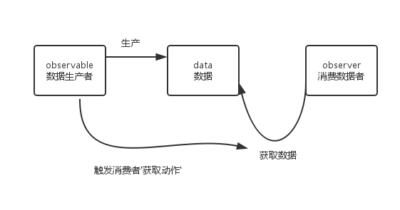
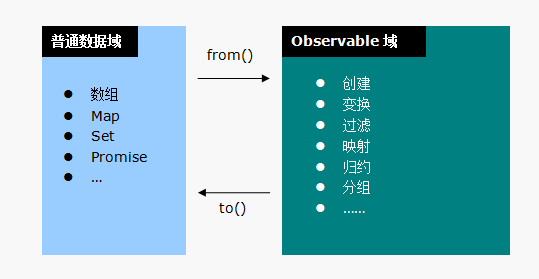

# 基本概念

__概念:__

* `Observable`: 数据生产者（可观测对象）
* `Observer`: 数据消费者（观测者）
* `Notification`: 数据（通知）

__RxJS - 扩展__

对观测者模式的实现是`RxJS`的核心，但这仅仅是`RxJS`旅程的开始。还记得`ReactiveX`吗？它的全称是：`Reactive Extensions`。没错，丰富的扩展 才是`RxJS`的威力所在。

`RxJS`将数据分为两种类型：

* 普通数据 - 比如数组、字符串、JSON对象之类的
* 可观测对象 - 比如使用`Rx.Observable.create()`方法获得的对象

这些扩展的方法，`RxJS`称之为`操作符/Operator`，一个操作符通常返回的 是另一个新的`Observable`对象，这意味着它还处于`Observable`域，从而 可以将多个操作符链接起来，构成一条对`Observable`进行处理的流水线：

__Marble Diagram - 宝石图__

RxJS的文档中普遍采用宝石图/Marble Diagram来帮助我们理解一个操作符 的功能及时序关系：

一个操作符通常就是一个变换，在宝石图中用一个居中的方盒表示。 方盒的上方表示变换的输入，下方表示变换的输出。

在宝石图中最常见的输入和输出就是`可观测对象/Observable`，这意味着 这个变换是在`Observable`域内完成的。对于可观测对象，在宝石图中使用 一条时间线来表示，时间线上依次排列的多边形表示每一个产生的数据。

时间向右边流动，这意味着右边的数据更新鲜（发生时间离现在更近）。当 一个可观测对象正常结束时（它调用了观测者的`onCompleted()`方法），使用 一个竖线来标示。如果可观测对象在声明周期内发生了错误，则使用一个叉号 来标示。

由于可观测对象有明显的时间属性，我们有时也将其称为`可观测序列`。

