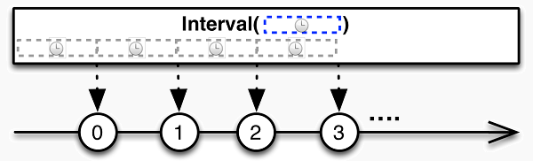

# 序列的创建与还原

__create__

使用`create`方法从零开始创建一个`可观测序列/Observable`：


`create`方法的参数是一个封装数据生成逻辑的函数，其参数为`观测者/Observer`：

```js
var generator = function(observer){
    //数据生成逻辑
}
Rx.Observable.create(generator);
```

在函数`generator`的实现中，通过调用参数对象`observer`的三个方法，实现数据 的生成、错误的通知和结束声明：

* onNext(data) - 向观测者传送新的数据`data`
* onError(err) - 通知观测者有错误发生，并且终止当前序列
* onCompleted() - 通知观测者当前序列已结束

__empty/never/throw__

`empty()`方法创建一个没有元素的空序列，并立刻结束：


`empty()`方法不需要参数。例如：

```js
var source = Rx.Observable.empty();
```

这等效于下面的代码：

```js
var source = Rx.Observable.create(function(o){
    o.onCompleted();
})
```

`never()`方法创建一个没有元素的空序列，并且永远不结束:


```js
var source = Rx.Observable.never();
```

这等效于下面的代码：

```js
Rx.Observable.create(function(o){
})
```

`throw()`方法创建一个没有元素的空序列，并且立刻抛出错误：


`throw()`方法的参数来声明错误对象。例如：

```js
var source = Rx.Observable.throw("What are you nongshalei?");
```

这等效于下面的代码：

```js
Rx.Observable.create(function(o){
    o.onError("What are you nongshalei?");
})
```

__range__

使用`range()`方法可以创建一个有限长度的`整数序列/Observable`：


`range()`方法需要两个参数：第一个参数声明序列的起始值，第二个参数 声明序列的元素数量：

```js
//从30开始生成3个数的序列
Rx.Observable.range(30,4)  //输出：30 31 32 33
```

__interval__
使用`interval()`方法创建一个无限长度的周期性`可观测序列/Observable`：



`interval()`方法的参数声明了以毫秒/ms为单位的周期，序列的元素值从0 开始，每个周期比前一周期加1：

```js
Rx.Observable.interval(1000) //输出： 0 1 2 3 4 ....
```

需要指出的是，序列是在每个周期末生成值。因此，在第一个值输出之前，有一个 周期静默。

__timer__

和`interval()`不同，`timer()`可以指定一个额外的参数来调节第一个值 生成之前的静默时长：


`timer()`的第一个参数用来`静默时长`，第二个参数用来声明`周期`，两个参数的单位 都是毫秒/ms：

```js
//立即输出第一个值
Rx.Observable.timer(0,1000) //输出： 0 1 2 3 4 5 ...
```

非周期序列

`timer()`方法的第二个参数是可选的，在忽略第二个参数的情况下，`timer()`将 仅仅在规定的静默时长后输出一个值，然后结束序列：


```js
//1秒后输出0
Rx.Observable.timer(1000) // 输出： 0
```

__from / pairs__

使用`from()`方法，可以将已有的数据集转化为`可观测序列/Observable`：


```js
Rx.Observable.from(iterable);
```

RxJS支持的数据集类型包括：

* `数组/Array` - 例如：["a","c","f"]，数组的每个`成员`对应序列的一个元素
* `字符串/String` - 例如："This is a demo"，字符串的每一个`字符`对应序列的一个元素
* `唯一集/Set` - 在ES6中新增的Set对象，可以保证所有成员的唯一性。和数组 一样，其每个`成员`对应序列的一个元素
* `有序键值对/Map` - 在ES6中新增的Map对象，类似于JSON对象，但它是按插入 次序进行遍历。Map对象的每个`键值对`，对应序列的一个元素

pairs()

对于传统的JSON对象，RxJS也提供了一个`pairs()`方法将其转化为可观测序列， 和Map对象一样，每个`键值对`也对应序列的一个元素：

```js
var score = {
    math: 80,
    art: 90,
    music: 88
}
Rx.Observable.pairs(score) // 序列： ["math",80]  ["art",90] ["music",88]
```

__of__

不在同一个数据集中的多个来源的数据，可以使用of()方法直接构造 `可观测序列/Observable`：


`of()`方法可以传入任意数量的参数，每个参数对应序列中的一个元素：

```js
Rx.Observable.of("A","X","D","E") //序列： A X D E
```

你可以认为`of()`方法是针对多源数据场景的特定`from()`调用：

```js
//与前例等效
var data = ["A","X","D","E"]
Rx.Observable.from(data)
```

__just__

可以使用`just()`方法将任何数据转化为一个单值输出的`可观测序列/Observable`：


`just()`方法的参数将被作为序列的唯一元素输出。你可以传入任意类型的数据：

```js
Rx.Observable.just([1,2,3]) //输出：[1,2,3]
Rx.Observable.just({x:1,y:2}) //输出：{x:1,y:2}
```

当用于数组等数据集时，`just()`不处理传入的数据，因此整个数组被作为一个值， `一次性`完整输出，而`from()`方法将分解数组，`逐个`输出。

`just()`方法的一个别名是`return()`，两者的行为完全一致：

```js
Rx.Observable.return("hello") //输出： "hello"
```

__repeat__

使用`repeat()`方法创建一个重复值序列：


`repeat()`方法的第一个参数指定需要重复的值，第二个参数指定重复的次数：

```js
Rx.Observable.repeat("A",5) //序列：A A A A A
```

__fromEvent/fromEventPattern__

使用`fromEvent()`方法，可以将`事件流`转化为`可观测序列/Observable`，每个事件 对应序列中的一个元素：


`fromEvent()`方法的第一个参数用来指定一个`事件源`对象，第二个参数指定需要 监听的`事件名称`：

```js
var el = document.getElementById("btn"); //DOM对象作为事件源
Rx.Observable.fromEvent(el,"click"); //序列: <EVENT1> <EVENT2> ....
```

`fromEvent()`方法还支持一个可选的`映射函数`作为第三个参数，映射函数负责 转换传入的事件，其返回值将作为序列的元素：

```js
var el = document.getElementById("btn"); //DOM对象作为事件源
var mf = function(event){
    return [event.offsetX,event.offsetY];
};
Rx.Observable.fromEvent(el,"click",mf); //序列: [??,??] [??,??] ...
```

RxJS支持以下类型的事件源：DOM对象、jQuery对象、Zepto对象、Angular对象、 Ember.js对象或者EventEmitter对象。

__fromEventPattern()__

另一种将事件流转化为序列的手段是使用`fromEventPattern()`方法。区别在于， 你需要使用两个函数分别封装监听事件和解除监听事件的逻辑，然后，将这两个函数 作为`fromEventPattern()`的方法：

```js
//handler是RxJS传入的事件处理函数, 就是subscribe的第一个函数
var addListeners = function(handler){
    el.addEventListener("click",handler);
    el.addEventListener("mousemove",handler);
};
var removeListeners = function(handler){
    el.removeEventListener("click",handler);
    el.removeEventListener("mousemove",handler);
};
Rx.Observable.fromEventPattern(addListeners,removeListeners);
```

`fromEventPattern()`方法的优点是，可以一次将多个对象的多种事件转化为 一个事件序列。

__toArray__

使用`toArray()`方法将序列还原为数组对象：


需要指出的是，`toArray()`方法返回的还是一个`可观测序列/Observable`， 因此需要订阅后获得还原的结果：

```js
var source = Rx.Observable.of(1,2,3,4);    //序列：1 2 3 4 
var target = source.toArray(); //序列：[1,2,3,4]
target.subscribe(function(d){
        console.log(d);        //d： [1,2,3,4]
    })
```

__toMap__

使用toMap()方法将序列还原为一个Map对象：


`toMap()`方法的第一个参数用来声明键选择函数：

```js
var data = [
    {id:123,name:"John"},
    {id:456,name:"Kate"}
];
var source = Rx.Observable.from(data); //序列： {...} {...}
var ksf = function(d){
    return d.id;  //使用id作为键
}
var target = source.toMap(ksf);       //序列：Map{123=>{...},456=>{...}}
```

可选的，可以为toMap()方法指定第二个参数来声明值选择函数：

```js
var vsf = function(d){
    return d.name; //使用name作为值
};
var target = source.toMap(ksf,vsf);   //序列： Map{123=>John,456=>Kate}
```

同样，toMap()方法返回的还是一个`可观测序列/Observable`，因此需要订阅后 获得结果：

```js
target.subscribe(function(item){
    item.forEach(function(key,val){
        console.log([key,val]);     
        //123,John
        //456,Kate
    })
});
```

__toSet__

使用`toSet()`方法将一个序列还原为Set对象：


同样，`toSet()`方法返回的还是一个`可观测序列/Observable`， 因此需要订阅后获得还原的结果：

```js
var source = Rx.Observable.of(1,2,3,4)    //序列：1 2 3 4 
var target = source.toSet();   //序列: Set{1,2,3,4}
target.subscribe(function(d){
        console.log(d);        //d： Set{1,2,3,4}
    })
```
