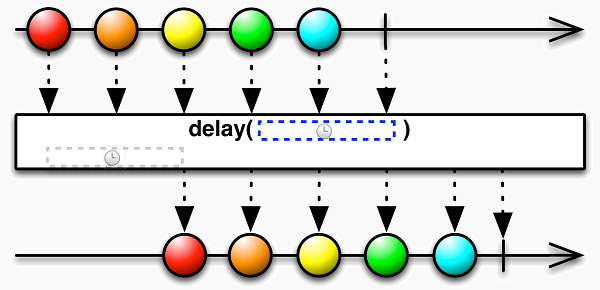
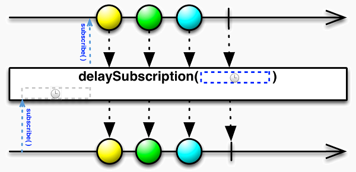
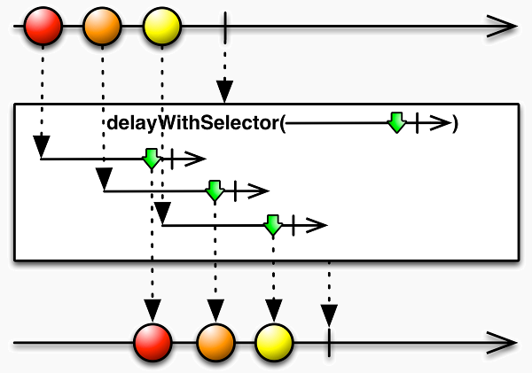
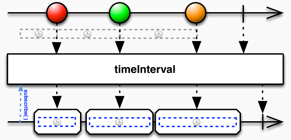
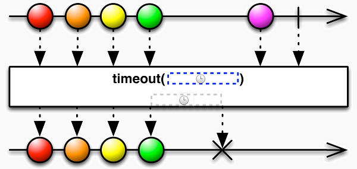
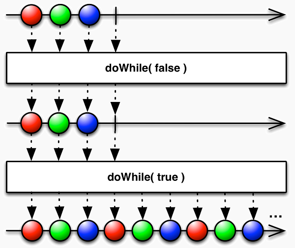
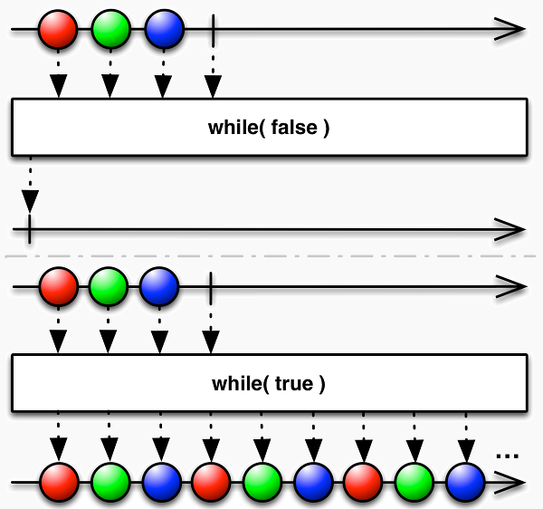

# 序列的常用变换

__延迟-delay__

使用`delay()`方法将序列推迟指定的时间：



`delay()`的参数用来声明延迟的具体时间，以毫秒/ms为单位：

```js
var source = Rx.Observable.timer(0,1000); //序列： 0 1 2 ...
var target = source.delay(1000); //序列延迟1秒：0 1 2 ...
```

也可以传入一个`Date`对象，声明序列开始具体时间：

```js
var source = Rx.Observable.timer(0,1000); //序列： 0 1 2 ...
var t = new Date(Date.now + 1000*60); //1小时之后
var target = source.delay(t); //序列延迟1小时：0 1 2 ...
```

__delaySubscription__

与delay()不同的是，delaySubscription()方法通过延迟观测者 的订阅行为而实现类似的延迟效果：



类似的，delaySubscription()方法的参数可以是一个数字或一个 Date对象：

```js
var source = Rx.Observable.timer(0,1000); //序列： 0 1 2 ...
var target = source.delaySubscription(1000); //序列延迟1秒：0 1 2 ...
```

__delayWithSelector__

如果需要为序列中的各元素指定不同的延时，可以使用`delayWithSelector()`方法：



`delayWithSelector()`方法使用一个延时函数来分别获取每个元素的延时效果：

```js
var source = Rx.Observable.timer(0,1000);
//延时函数应当返回一个序列，当该序列结束时，源序列发送当前元素d
//各元素分别延时： 0 400 800 1600 2000 0 400 ...
var df = function(d){
    var delay = (d % 5) * 400;  //延时 0 ~ 2000 ms
    return Rx.Observable.timer(delay);
};
var target = source.delayWithSelector(df);
```

__附加时间间隔-timeInterval__

timeInterval()方法为序列中的每个元素添加与前一个元素的间隔时长，以毫秒 为单位：



timeInterval()返回的新序列中，每个元素都具有如下的形式：

```js
{
    value: ...   //源序列中对应元素的值
    interval: ... //与前一个元素的时间间隔
}
```

__超时报警 - timeout/timeoutWithSelector__

每当源序列生成一个元素，`timeout()`就开始计时，如果超过一定的时间，源序列 还没有生成下一个元素，`timeout()`方法就抛出错误。这类似于硬件电路里的看门狗：



`timeout()`的第一个参数声明以毫秒为单位的超时长度，以毫秒为单位。第二个参数 是可选的，用来声明抛出的错误：

```js
var source = Rx.Observable.timer(3000); //序列： 0 
var target = source.timeout(1000,new Error("timeout!")); //序列：<ERROR>
```

__附加时间戳 - timestamp__

`timeStamp()`方法为序列中的每个元素添加`Linux时间戳`：


`timeStamp()`返回的新序列中，每个元素都具有如下的形式：

```js
{
    value: ...   //源序列中对应元素的值
    timestamp: ... //元素生成的时间戳
}
```


__序列循环 - doWhile/while__

`doWhile()`方法可以在满足条件的情况下循环执行一个已有序列：



`doWhile()`方法的参数是一个断言函数，函数的返回值如果为true， 就继续执行一次源序列，否则就结束序列：

```js
var source = Rx.Observable.of(1,2,3); //序列： 1 2 3 
var loops = 2;
var target = source.doWhile(function(){
    return loops-- > 0;
}); //序列： 1 2 3 1 2 3 
```

`doWhile()`方法总是先复制一次源序列，即使条件不满足。

__while()__

和doWhile()不同，while()方法先检查条件是否满足，再执行 源序列：



while()是类方法，以Rx.Observable.while()的形式调用， 它的第一个参数也是一个断言函数，其返回值将作为判断的依据； 第二个参数则指定用来循环执行的序列：

```js
var source = Rx.Observable.of(1,2,3); //序列： 1 2 3
var loops = 2;
var target = Rx.Observable.while(
    function(d){  return loops-- > 0; },
    source
); //序列： 1 2 3 1 2 3
```


