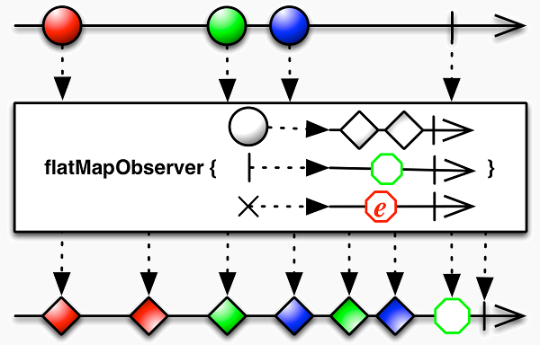

# 序列的成员映射

__映射 - map__

使用`map()`方法对序列成员进行变换，并返回一个新的序列：


map()方法的参数是一个`变换函数`，将作用于源序列的每一个元素， 函数的返回值就是目标序列中对应的元素：

```js
//item - 值
//index - 索引 
var tfx = function(item,index){
    return item * 2;
};
var source = Rx.Observable.of(1,2,3); //输出： 1 2 3
var target = source.map(tfx);   //输出： 2 4 6
```

`map()`方法的一个别名是`select()`，两者行为一致，可以互换。

__属性映射 - pluck__

如果源序列的元素值是JSON对象，那么可以使用`pluck()`方法选择某个具体`属性` 值生成新的序列：


`pluck()`方法使用源序列的元素对象指定`属性`的值，构造返回新的序列：

```js
var source = Rx.Observable.of({name:"John",age:22},{name:"Linda",age:21});
var target = source.pluck("name"); //序列： John Linda
```

`pluck()`方法是特定场景下对`map()`方法的简化

```js
//等效于前例
var target = source.map(function(item){ return item["name"]; });
```

__平坦化映射 - flatMap__

`flatMap()`方法包括两个步骤：首先将一个序列的各元素映射为序列，然后将各元素 序列融合：


`flatMap()`的参数是一个映射函数，其返回值应当是一个序列：

```js
var source = Rx.Observable.of(10,20,30); //序列：10 20 30
var mf = function(item){
    return Rx.Observable.range(item,3);
};
var target = source.flatMap(mf);  //序列：10 11 12 20 21 22 30 31 32
```

__活动序列平坦化映射 - flatMapLatest__

`flatMapLatest()`与`flatMap()`的区别在于，它仅仅将最新激活的元素序列 中的元素，输出到目标序列中：


与`flatMap()`一样，`flatMapLatest()`的参数需要指定一个映射函数，其返 回值应当为一个序列。

`flatMapLatest()`方法的别名是`selectSwitch()`。

__通知的平坦化映射 - flatMapObserver__

flatMapObserver()方法为源序列的每一个元素、错误通知、结束通知都创建一个序列：



flatMapObserver()方法的参数是三个函数，分别对应onNext，onError和onComplete， 每个函数都应当返回一个序列：

```js
var source = Rx.Observable.of(1,2,3);
var nf = function(d,i){ return Rx.Observable.of(d).delay(i*1000);};
var ef = function(err){ return Rx.Observable.of("error");};
var cf = function(){ return Rx.Observable.of("completed");}
var target = source.flatMapObserver(nf,ef,cf); //序列：1 2 3 completed
```

__拼接映射 - concatMap__

`concatMap()`方法将源序列的各元素映射为序列，然后按顺序拼接起来：


和`flatMap()`一样，`concatMap()`方法需要一个映射函数，其返回值应当 为序列：

```js
var source = Rx.Observable.of(1,2,3);
var mf = function(item){
    return Rx.Observable.range(item,3);
};
var target = source.concatMap(mf); //序列：1 2 3 2 3 4 3 4 5
```

__通知的拼接映射 - concatMapObserver__

concatMapObserver()方法将源序列的元素、错误通知、结束通知都转化为序列， 并按顺序拼接为目标序列：


和flatMapObserver()方法一样，concatMapObserver()方法的参数为三个 映射函数，分别对应onNext, onError和onComplete：

```js
var source = Rx.Observable.of(1,2,3);
var nf = function(d,i){ return Rx.Observable.of(d).delay(i*1000);};
var ef = function(err){ return Rx.Observable.of("error");};
var cf = function(){ return Rx.Observable.of("completed");}
var target = source.concatMapObserver(nf,ef,cf); //序列：1 2 3 completed
```