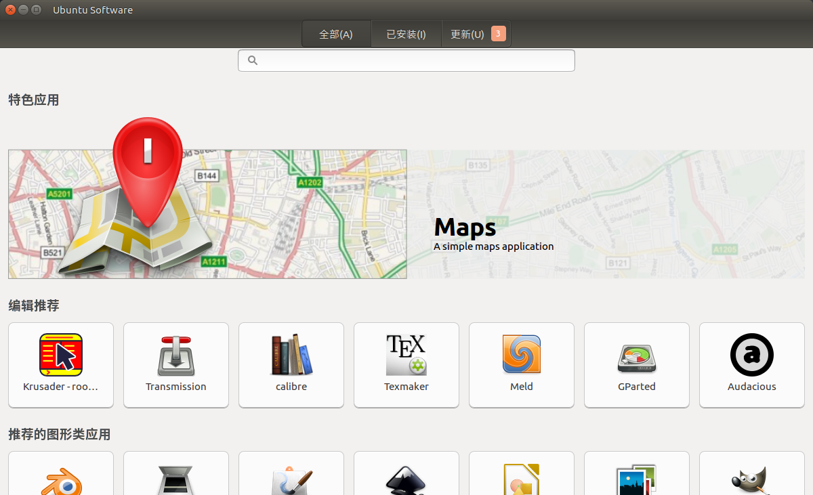
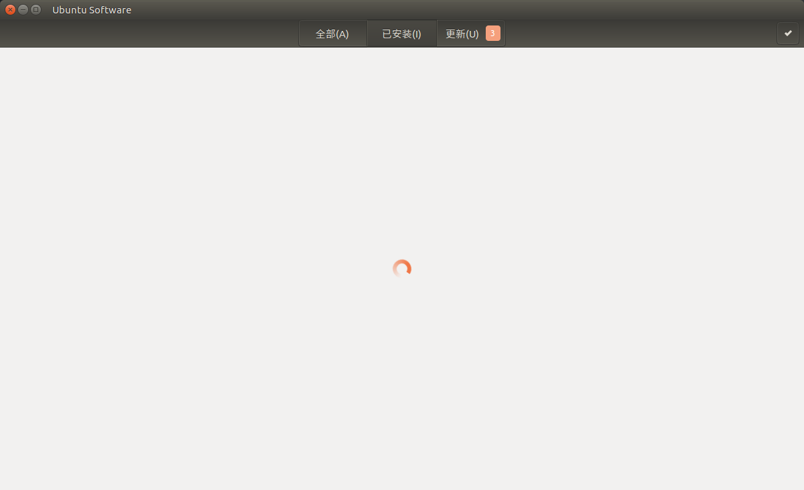
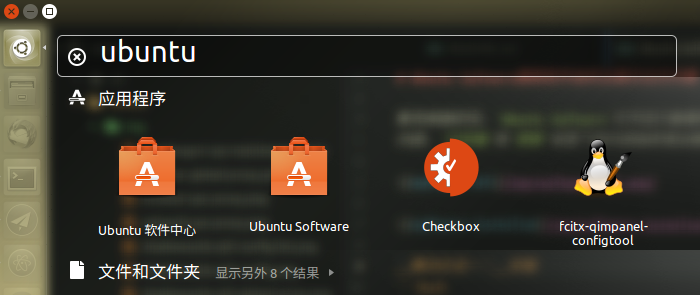

# Ubuntu Software搜索软件始终加载状态的问题

新系统装好后，`Ubuntu Software`打开后只能看到`全部`标签下的内容，`已安装`和`更新`标签下的内容始终是加载状态，如下图：





__解决办法：__安装另外一个`ubuntu软件中心`
```bash
sudo apt-get install software-center
```
中文名称的那个`软件中心`是可以正常使用的



原因好像是因为16.04版本要废弃`Ubuntu Software`了。
