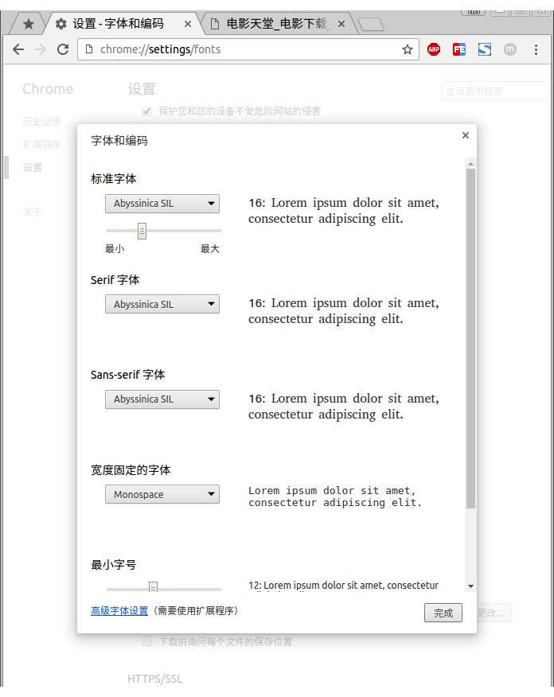

# chrome浏览器字体发虚，模糊

*   `firefox`版本`45.0.2`
*   `chrome`版本`51.0.2704.63 (64-bit)`

什么样的模糊呢，直接上对比图：

然后是`google`搜了N小时，其实解决办法很简单，打开`chrome`浏览器的`设置`->`显示高级设置`->找到网络内容设置的`自定义字体`，如下图：

将`标准字体`换成如下字体即可:

设置完毕后，重新打开网页，再来一张对比图：

舒畅了。
