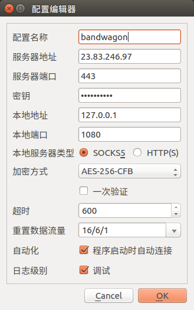
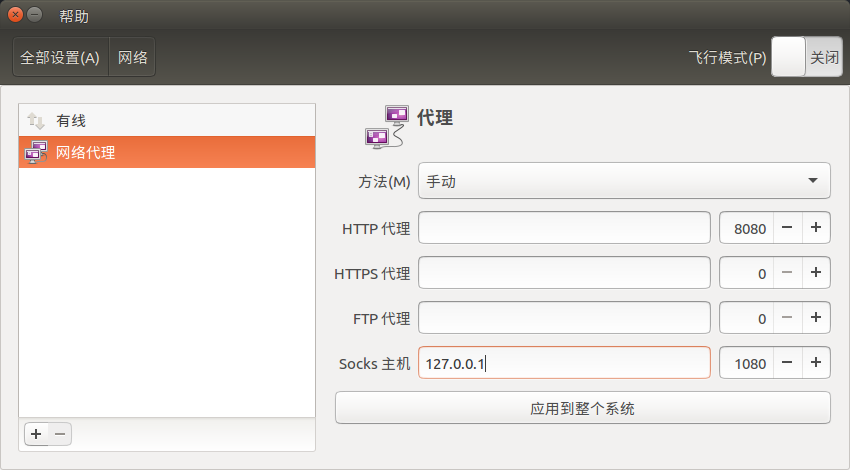
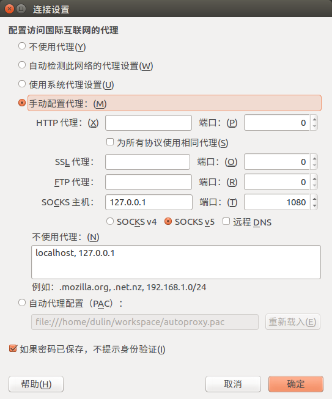
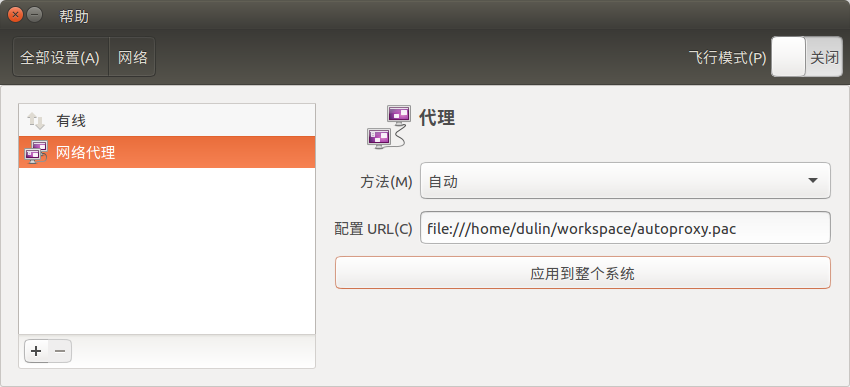
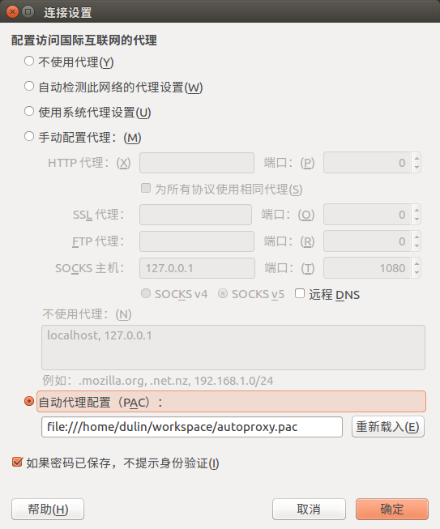

# shadowsocks-qt5的pac模式解决方案

`mac`和`windows`系统的ss客户端都提供了__全局代理模式__和__`pac`代理模式__，然而`linux`系统从官方`issue`上看到没有提供`pac`代理模式，只支持全局代理模式，这里有个解决方案：

__如何设置`ss`及代理:__

`shadowsocks-qt5`配置如下图：



系统网络全局代理设置如下图:



这样设置，系统所有应用(浏览器，一些应用客户端等)的网络请求都是全局代理，国内，国外的请求都会先经过代理服务器，然后才是目标服务器，缺点就是，访问国内不需要翻墙的资源时慢，且废流量。

浏览器全局代理设置如下图，以`firefox`为例，打开菜单栏`编辑`->`首选项`->`高级`->`网络`->连接`设置`：



和系统网络全局代理的设置一样，这样设置，只有`firefox`浏览器的网络请求走代理服务器（能翻墙了），其他浏览器，系统的其他应用的网络请求都不会走代理服务器（不能翻墙）

__`linux`系统设置`pac`代理模式:__

使用[genpac](https://github.com/JinnLynn/genpac)，安装
```bash
dulin@dulin-GA-MA770T-UD3P:~$ sudo pip install genpac
The directory '/home/dulin/.cache/pip/http' or its parent directory is not owned by the current user and the cache has been disabled. Please check the permissions and owner of that directory. If executing pip with sudo, you may want sudo's -H flag.
The directory '/home/dulin/.cache/pip' or its parent directory is not owned by the current user and caching wheels has been disabled. check the permissions and owner of that directory. If executing pip with sudo, you may want sudo's -H flag.
Collecting genpac
Installing collected packages: genpac
Successfully installed genpac-1.3.1
You are using pip version 8.1.1, however version 8.1.2 is available.
You should consider upgrading via the 'pip install --upgrade pip' command.
dulin@dulin-GA-MA770T-UD3P:~$ genpac -v
genpac 1.3.1
```

生成`pac`文件

```bash
dulin@dulin-GA-MA770T-UD3P:~$ sudo genpac -p "SOCKS5 127.0.0.1:1080" --gfwlist-proxy="SOCKS5 127.0.0.1:1080" --gfwlist-url="https://raw.githubusercontent.com/gfwlist/gfwlist/master/gfwlist.txt" --output="./workspace/autoproxy.pac"
```

在`/home/dulin/workspace/`目录下生成`autoproxy.pac`文件

然后在`系统设置`->`网络`->`网络代理`中设置系统网络`pac`代理，如下图：



设置完成后，系统的所有应用的网络请求都会使用`pac`代理模式（浏览器设置为使用`系统代理设置`，也可以单独设置），即访问在`pac`列表（黑名单，也有白名单）中的服务器域名才会走代理服务器（翻墙），也就是说，`pac`这个文件中的服务器域名都是被墙的，国内网络不可以直接访问的，而这个列表之外的服务器域名（没有被墙的），可以直接访问，不经过代理服务器。

也可以不设置系统级别的网络代理，单设置`firefox`浏览器的`pac`代理，如下图：



这样设置后，只有`firefox`浏览器的网络请求是`pac`代理模式，系统的其他应用的网络请求没有代理，缺点：类似`npm`这样需要翻墙的工具可能就无法顺畅使用了。

`pac`代理模式的重点就在于找到一个稳定更新的`pac`文件
