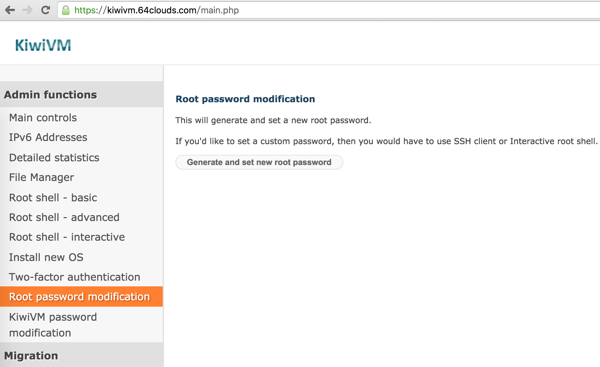
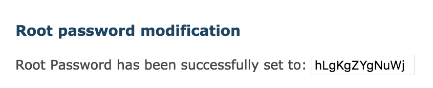
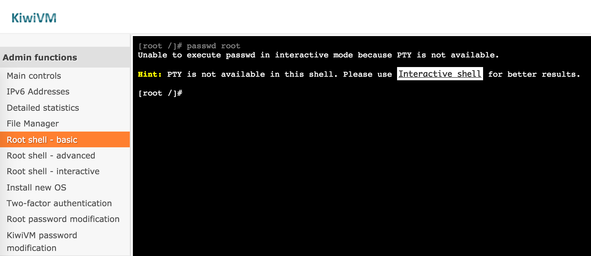
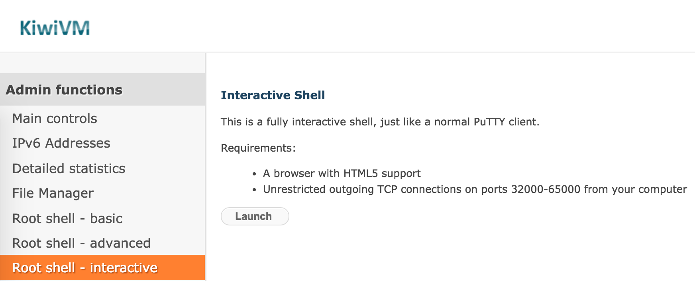
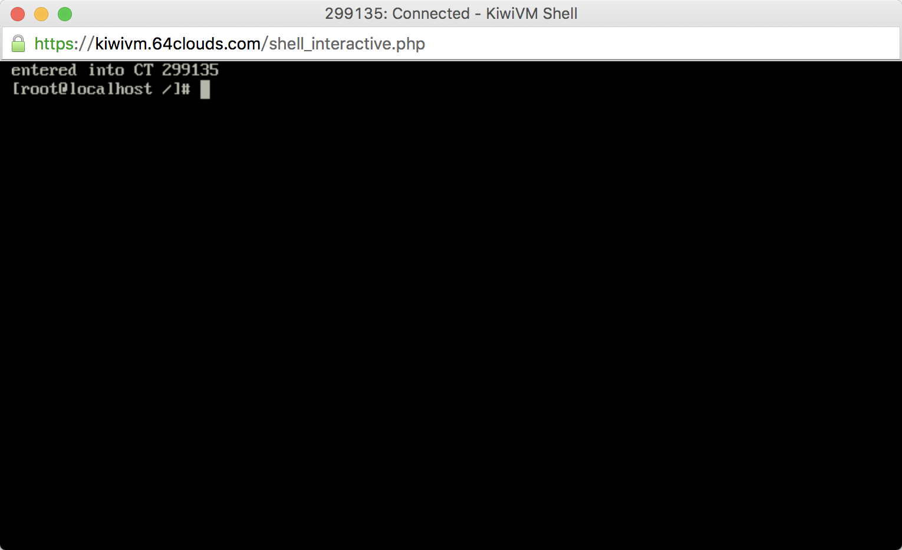
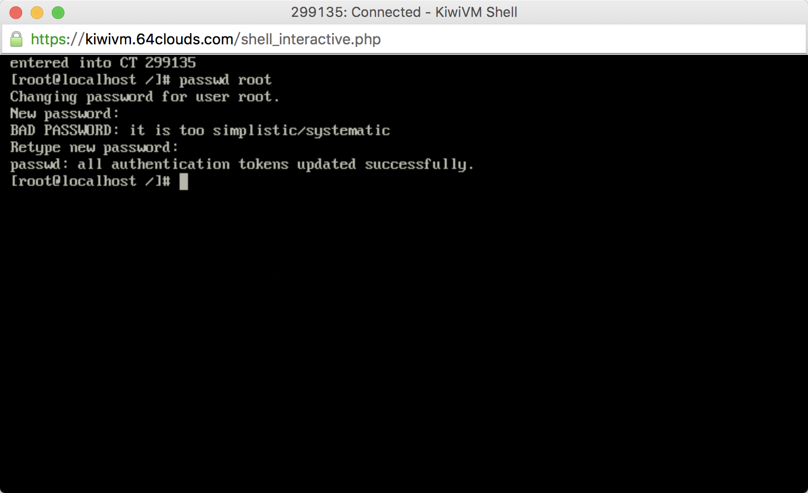
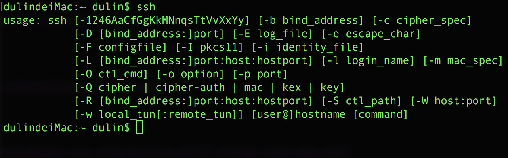
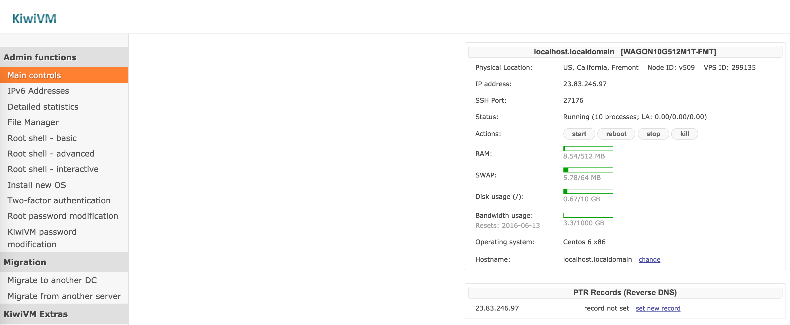

# bandwagon VPS Centos 6修改root用户密码并用ssh远程登录

`root`用户的密码第一次使用需要进入VPS控制面板生成，如下图:



点击`Generate and set new root password`按钮生成，如下图：



使用`Root shell - basic`尝试修改`root`用户密码，提示说`PTY`不可用，使用`Interative shell`，如下图：



点击那个高亮的`Interative shell`或者在控制面板左侧选择`Root shell - interative`进入交互式`shell`,如下图：



注意使用该`shell`的要求，点击`launch`开启，打开后如下图：



再次尝试修改`root`用户密码，如下图：



修改成功，但是提示说密码太简单，无所谓。

然后，打开`terminal`，`mac`下自带`ssh`，如下图：



`ssh`登录远程服务器的命令是`ssh user@hostname -p port`的形式，如果我们要以`root`用户的身份登录远程服务器，那么`user`就是`root`，`hostname`可以是远程服务器的域名也可以是`ip`，这里我们用远程服务器`ip`地址的方式，
那么去哪里看自己的`vps`的`ip`地址和端口呢？如下图：



`IP address`和`SSH Port`就是远程服务器的`ip`和端口，好，回到`terminal`进行`ssh`登录

```shell
dulindeiMac:~ dulin$ ssh root@23.83.246.97 -p 27176
root@23.83.246.97's password:
Last login: Thu Jun  2 03:48:18 2016 from 125.98.129.66
[root@localhost ~]#
```

输入我们刚才修改过的`root`用户的密码（以其他用户登录，需要各自的密码），登录成功。然后就可以在本地计算机上通过`terminal`操作远程服务器了，比起网页上控制面板的`shell`，当然是`mac`的`terminal`顺手了。

如果要退出远程服务器登录的话，输入`exit`即可

```shell
[root@localhost /]# exit
logout
Connection to 23.83.246.97 closed.
dulindeiMac:~ dulin$
```

以后如果`root`用户的密码忘了，只要再次进入VPS控制面板重新生成密码就可以了.
